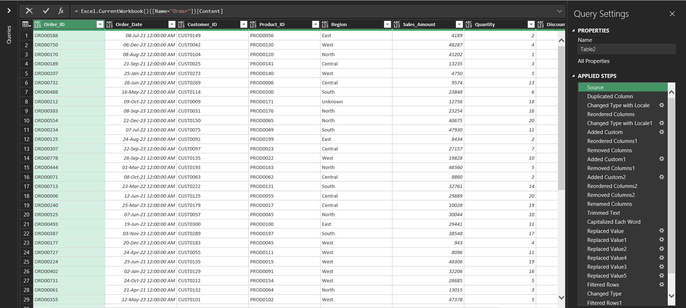
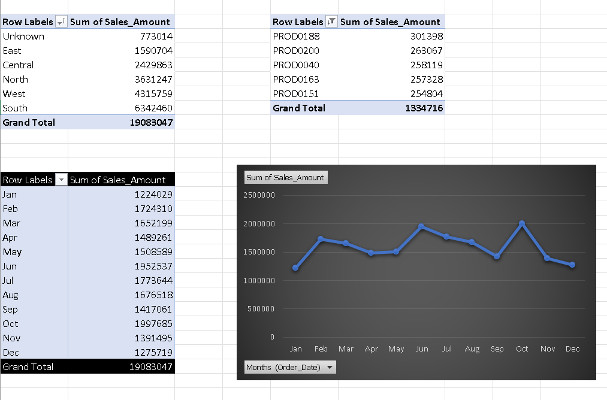

# 🛒 Retail Data Cleaning & Analysis

## 📌 Project Overview

This project focuses on cleaning and preparing a multi-sheet retail dataset and performing basic business analysis.

The original dataset contained multiple data quality issues such as missing values, inconsistent formats, duplicate records, and invalid entries, making it unsuitable for analysis.

---

## 🎯 Objective

To clean and standardize the dataset to ensure data accuracy, consistency, and reliability, and to derive meaningful business insights.

---

## 🛠 Tools Used

* Microsoft Excel
* Power Query

---

## 🔧 Data Cleaning Steps

* Standardized column names across all sheets
* Converted data types using Power Query
* Handled mixed date formats using locale-based conversion
* Removed rows with missing critical values (`customer_id`, `sales_amount`)
* Standardized categorical fields (`region`, `city`, `category`)
* Removed invalid data (negative `cost_price`)
* Cleaned numeric formatting issues (`selling_price`)
* Eliminated duplicate records

---

## 📊 Analysis Performed

* Total Sales by Region
* Top 5 Products by Sales
* Monthly Sales Trend

Pivot tables and charts were created using the cleaned dataset to generate business insights.

---

## 📂 Files

* `retail_raw_dataset.xlsx` → Original dataset
* `retail_cleaned_dataset.xlsx` → Cleaned dataset
* `retail_analysis.xlsx` → Analysis using pivot tables

---

## 📸 Screenshots

### Before Cleaning

### Power Query Steps

### After Cleaning

### Analysis Output

---

## ✅ Outcome

The dataset was successfully transformed into a clean and structured format, enabling accurate analysis and reliable business insights.

