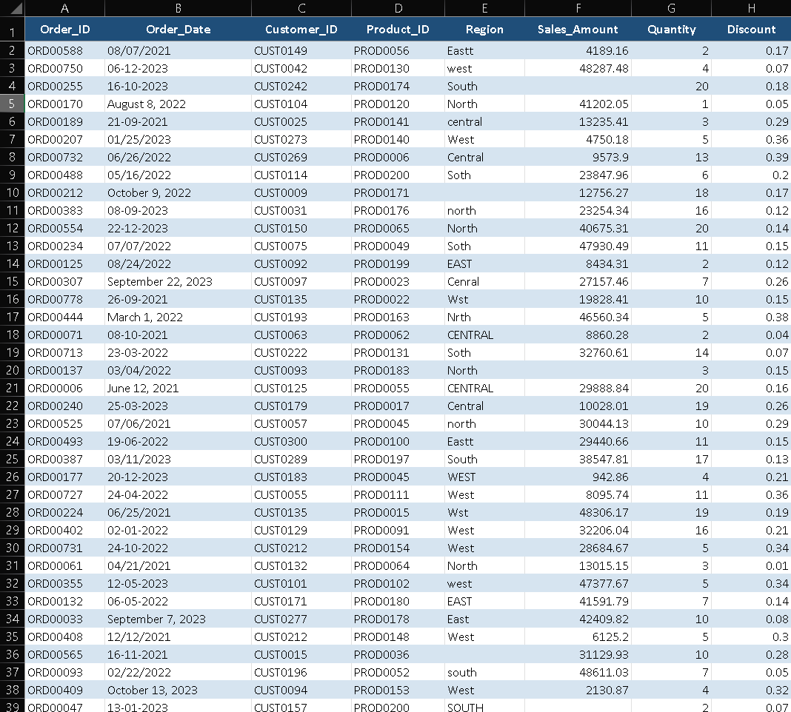
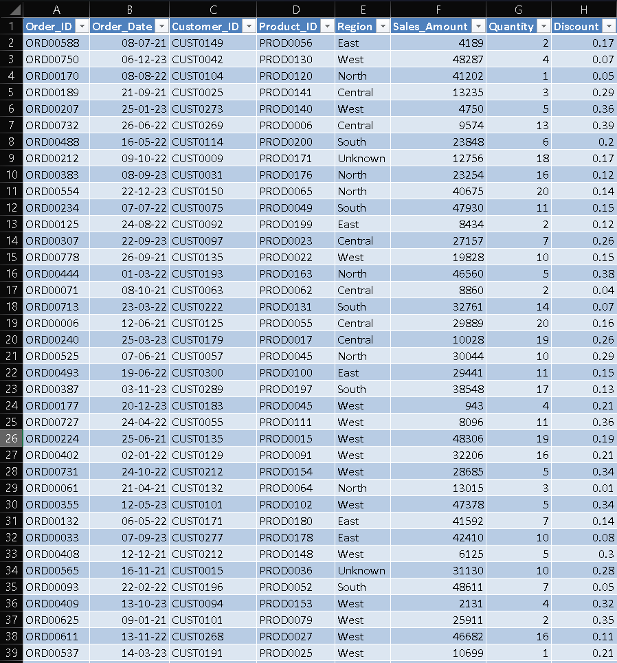

# Retail Data Cleaning & Preparation

## 📌 Overview
Cleaned a multi-sheet retail dataset using Excel and Power Query.

## 🛠 Tools
- Excel
- Power Query

## 🔧 Key Steps
- Handled missing values
- Fixed date formats
- Standardized categories
- Removed invalid and duplicate data

## 📂 Files
- Raw and cleaned datasets available in `/data`

## 📸 Screenshots

